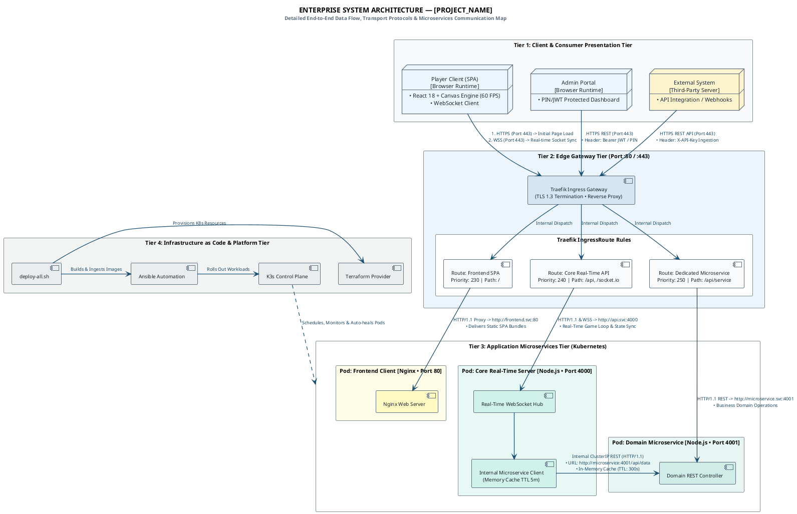

# 📐 Clean PlantUML Architecture Skill (Enterprise Standard)

This skill provides guidelines, styling rules, and reusable templates for creating high-clarity, production-grade System Architecture Diagrams in PlantUML that look hand-crafted by a Principal Cloud Architect with exhaustive technical metadata.

---

## 🚫 1. Anti-AI-Slop & Professionalism Principles

1. **No Rainbow/Gaudy Palettes**: Use neutral, cohesive corporate palettes inspired by AWS, GCP, and Stripe architectural diagrams (Slate Gray `#0F172A`, Muted Blue `#1E293B`, Soft Borders `#94A3B8`, Light Card Backgrounds `#FFFFFF` / `#F8FAFC`).
2. **No Emoji Clutter**: Avoid sprinkling emojis on every label. Use crisp technical terms and component basenames.
3. **Typography & Spacing**: Use clean sans-serif fonts (`Helvetica, Arial, sans-serif` or `Segoe UI`), font size 10-12px, with `roundCorner 3-4` and `shadowing false`.

---

## ⚡ 2. Fixing Floating Lines & Routing Glitches

### The Root Cause of Disconnected/Floating Lines:
- Using `interface` (circle socket) inside nested `package` blocks while using `linetypes ortho` or `!pragma layout smetana` causes Graphviz to miscalculate anchor offsets, drawing arrows *next* to the target without attaching.

### The Correct Enterprise Solution:
- **Direct Component-to-Component Connections**: Route from the Ingress Controller or Route Rule box directly into the target component/pod.
- **Route Rule Sub-Components**: Model Gateway routes as dedicated sub-components inside the Ingress package, and draw arrows straight down into the respective application pods below.

```plantuml
' ✅ CORRECT: Clean direct connections
TraefikGateway -down-> Route_Frontend
Route_Frontend -down-> Pod_Client_Engine : "ClusterIP: game-client:80"

' ❌ AVOID: Floating interface socket
interface "Route: /" as IngressSocket
TraefikGateway -> IngressSocket
IngressSocket -> Pod_Client_Engine
```

---

## 📝 3. Mandatory Line Details & Protocol Semantics

Every line in the architecture must provide technical depth:
1. **Transport Protocol & Security**: e.g., `HTTPS (Port 443, TLS 1.3)`, `WSS (Binary Engine.IO)`, `HTTP/1.1 REST (Internal ClusterIP)`.
2. **Ingress Rule & Priority**: e.g., `Priority: 250 | PathPrefix: /api/quiz`.
3. **Payload / Data Semantics**: e.g., `60Hz World State Broadcast`, `POST /api/quiz/sync (JSON Array)`.
4. **Resilience & Caching**: e.g., `In-Memory Cache (TTL: 300s, Auto-Sync: 30s)`.

---

## 🏗️ 4. Master Clean Architecture Template


