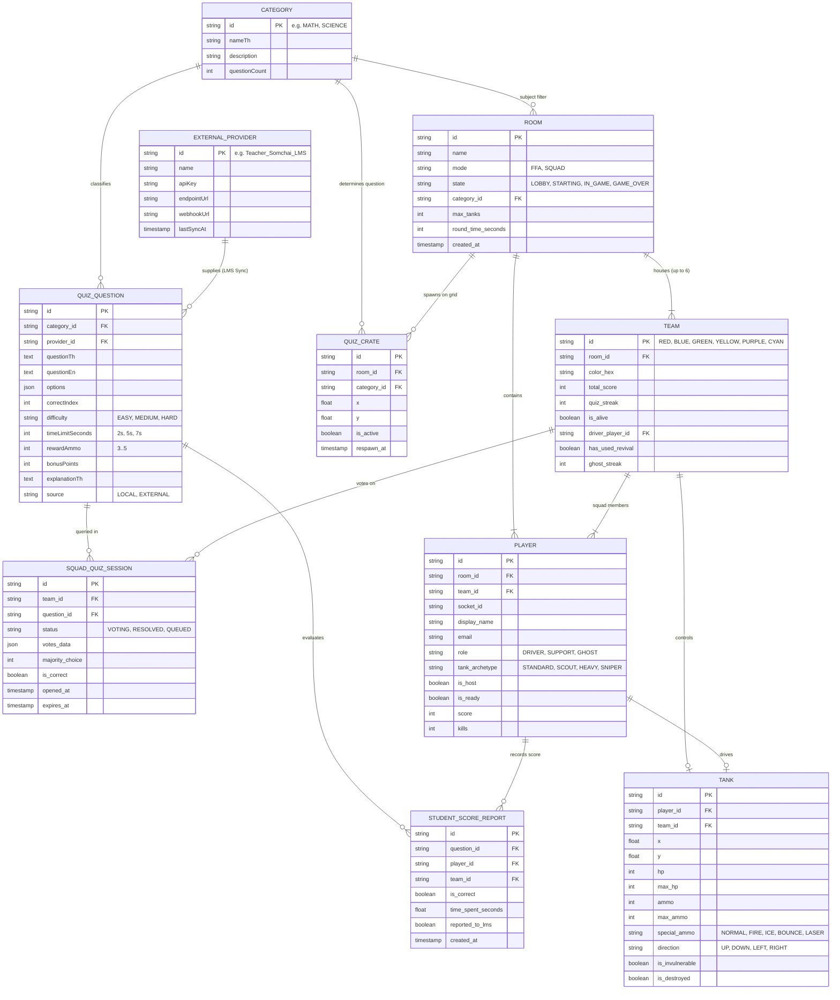

# 📑 คู่มือและเอกสารประกอบโครงงานระบบ Tank Quiz Battle 1990
## ระบบเกมเพื่อการศึกษาแบบเรียลไทม์ (Educational Real-time Multiplayer Gamification System)

---

## 1. บทนำและวัตถุประสงค์ของโครงการ (Introduction & Objectives)

**Tank Quiz Battle 1990** เป็นระบบเว็บแอปพลิเคชันเกมยิงรถถังแบบผู้เล่นหลายคนแบบเรียลไทม์ (Real-time Multiplayer 2D Canvas) สไตล์ตู้เกมอาร์เคดยุค 90 ที่ถูกพัฒนาขึ้นโดยมีวัตถุประสงค์เพื่อ:
1. **แก้ปัญหาความไม่กระตือรือร้นในการทำแบบฝึกหัดของนักเรียน**: โดยนำกลไก Gamification "ตอบคำถามเพื่อแลกกระสุนสำหรับใช้ต่อสู้ (Quiz-for-Ammo)" มาเป็นแรงจูงใจในการเรียนรู้
2. **ส่งเสริมการทำงานร่วมกันเป็นทีม (6-Team Squad Co-op Collaboration)**: รองรับห้องเรียนขนาดใหญ่ที่มีนักเรียนมากถึง 60+ คน โดยแบ่งบทบาทเป็น **พลขับ (Driver)** และ **ผู้ช่วยตอบคำถามประจำทีม (Support Crew)** ที่ใช้ระบบการลงคะแนนเสียงส่วนใหญ่ (Majority Consensus Voting)
3. **เปิดโอกาสให้อาจารย์ผู้สอนสามารถกำหนดเนื้อหาได้เอง (Custom Subject & Open REST API)**: อาจารย์สามารถเพิ่ม แก้ไข นำเข้าชุดข้อสอบของแต่ละวิชาเรียน และเลือกวิชาประจำห้องประลองได้ตามต้องการ
4. **รองรับอุปกรณ์ที่หลากหลาย (Cross-Platform & Mobile Friendly)**: ใช้งานได้สมบูรณ์ทั้งบนคอมพิวเตอร์ แท็บเล็ต และสมาร์ตโฟน โดยไม่ต้องติดตั้งแอปพลิเคชันเพิ่มเติม

---

## 2. สถาปัตยกรรมระบบ (System Architecture)

ระบบถูกออกแบบด้วยสถาปัตยกรรม **Decoupled Microservices & Traefik Single Gateway Architecture**:

```
+-----------------------------------------------------------------------------------------------+
|                                  KUBERNETES / K3S CLUSTER                                     |
|                                                                                               |
|  [ TRAEFIK GATEWAY INGRESS (Port :80 / :443) ]                                                |
|           │                                                                                   |
|           ├──▶ Path: /                          ==▶ [ game-client ] (React 18 + Canvas 60 FPS)|
|           │                                                                                   |
|           ├──▶ Path: /api, /socket.io, /auth    ==▶ [ game-server ] (2D Physics & WebSockets) |
|           │                                              │                                    |
|           │                                              ▼ Internal Fast Client (Cache 5m)    |
|           └──▶ Path: /api/quiz                  ==▶ [ quiz-service ] (Standalone Port 4001)   |
|                                                          │                                    |
|                                                          ▼ External Sync & Webhook            |
|                                                     [ Teacher LMS / School Database ]         |
+-----------------------------------------------------------------------------------------------+
```

### 2.1 ส่วนประกอบของระบบ (Core Components)

1. **Frontend (game-client)**:
   - **React 18 + TypeScript + Vite**: โครงสร้างคอมโพเนนต์ที่รวดเร็วและปลอดภัยต่อ Type
   - **HTML5 2D Canvas Renderer (`RetroCanvas.tsx`)**: เรนเดอร์สมรภูมิรถถัง แอนิเมชันกระสุน ระเบิด และแผนที่แบบ 60 FPS
   - **8-Bit Chiptune Audio Synthesizer (`soundFx.ts`)**: สังเคราะห์คลื่นเสียงแบบเรียลไทม์ผ่าน Web Audio API
   - **Virtual Slide D-Pad & Touch Controls (`TouchControls.tsx`)**: แผงควบคุมเสมือนบนหน้าจอมือถือ รองรับการลากเลี้ยว 8 ทิศทาง
   - **Squad Support Console (`SquadSupportView.tsx`)**: หน้าจอโหวตตอบคำถามและควบคุมโดรนส่งเสบียง
   - **Teacher Portal View (`TeacherPortalView.tsx`)**: แดชบอร์ดสำหรับอาจารย์ จัดการห้องแข่งขันและคลังข้อสอบ (ป้องกันด้วย PIN: 1990)

2. **Standalone Quiz Microservice (quiz-service: Port 4001)**:
   - **Open REST API & External LMS Sync (`server.ts`)**: จัดการโจทย์ข้อสอบ, แยกหมวดหมู่วิชา, และสุ่มตามความยาก
   - **External LMS Adapter (`externalAdapter.ts`)**: รองรับให้อาจารย์ยิงข้อสอบจากระบบโรงเรียนเข้ามาผ่าน API Key (`POST /api/quiz/sync`)
   - **Student Score Webhooks**: ส่งผลคะแนนเก็บของนักเรียนกลับไปยังระบบอาจารย์อัตโนมัติ

3. **Core Game Server (game-server: Port 4000)**:
   - **Authoritative Game Physics Engine (`gameEngine.ts`)**: คำนวณตำแหน่งการเคลื่อนที่ การชน (AABB Collision) และ Mega Laser Piercing
   - **Room & Matchmaking Manager (`roomManager.ts`)**: จัดการห้องแข่งขัน การเลือก 6 ทีม การเลือกบทบาท และระบบกระจายทีมสมดุล (Auto-Balance)
   - **Quiz Client (`quizClient.ts`)**: ดึงข้อสอบจาก `quiz-service` พร้อม In-Memory Cache (TTL 5 นาที) และ Fallback กันแล็ก 100%

---

## 3. แผนภาพความสัมพันธ์ของข้อมูล (Entity-Relationship Diagram — ERD)



---

## 4. กลไกการทำงานของเกม (Game Mechanics & Rules)

```
[ คนขับรถถัง (Driver) ] ──▶ วิ่งชนกล่องคำถาม [?] บนแผนที่
                                 │
                                 ▼
                     [ ระบบเปิดรอบโหวตคำถาม (2, 5, 7 วินาที) ]
                                 │
            ┌─────────────────────┴─────────────────────┐
            ▼                                           ▼
[ ผู้ช่วยตอบคนที่ 1 โหวต ]                 [ ผู้ช่วยตอบคนที่ 2, 3..N โหวต ]
            │                                           │
            └─────────────────────┬─────────────────────┘
                                  ▼
                     [ รวมคะแนนเสียงข้างมาก (Consensus) ]
                                  │
              ┌───────────────────┴───────────────────┐
              ▼ (โหวตถูก)                             ▼ (โหวตผิด)
   • ส่งกระสุน +3 ถึง +5 นัดให้คนขับ       • ไม่ได้รับกระสุน
   • ได้รับคะแนนทีม + โบนัส                • ติดสตัน 1.5 วินาที
```

### 3.1 กฎกติกาและการควบคุมเวลาตามระดับความยาก:
- **🔥 คำถามยาก (HARD)**: ให้เวลาตอบ **7 วินาที** (โจทย์คำนวณหลายขั้นตอน, ฟิสิกส์, ตรรกศาสตร์)
- **⚡ คำถามปานกลาง (MEDIUM)**: ให้เวลาตอบ **5 วินาที** (โจทย์วิเคราะห์, ไวยากรณ์, วิทยาศาสตร์ทั่วไป)
- **🟢 คำถามง่าย (EASY)**: ให้เวลาตอบ **2 วินาที** (ประลองความไว Speed Quiz, ทายศัพท์)

### 3.2 กฎการเข้าคิวคำถาม (Sequential Question Queuing):
- หากคนขับเก็บกล่องคำถามมากกว่า 1 กล่องในขณะที่คำถามก่อนหน้ายังไม่หมดเวลา คำถามใหม่จะถูกนำเข้าคิวรอ (`squadQuizQueues`)
- เมื่อเวลานับถอยหลังของข้อปัจจุบันสิ้นสุดลง ระบบจะสรุปผล แสดงเฉลย ~2.8 วินาที และเปิดคำถามข้อถัดไปในคิวโดยอัตโนมัติ

---

## 4. รายละเอียด Open REST API Specification (สำหรับอาจารย์)

### 4.1 ตาราง Endpoints

| Method | Endpoint | คำอธิบาย | พารามิเตอร์ / Body |
| :--- | :--- | :--- | :--- |
| `GET` | `/api/quiz/questions` | ดึงรายการข้อสอบทั้งหมด | `?category=...&difficulty=...&search=...` |
| `GET` | `/api/quiz/categories` | ดึงรายชื่อวิชาทั้งหมดพร้อมจำนวนข้อ | - |
| `GET` | `/api/quiz/questions/:id` | ดึงข้อสอบรายข้อตาม ID | `id` (path parameter) |
| `POST` | `/api/quiz/questions` | เพิ่มโจทย์คำถามใหม่ | JSON Object ของข้อสอบ |
| `PUT` | `/api/quiz/questions/:id` | แก้ไขโจทย์คำถาม | JSON Object ของข้อสอบที่ต้องการแก้ |
| `DELETE` | `/api/quiz/questions/:id` | ลบโจทย์คำถาม | `id` (path parameter) |
| `POST` | `/api/quiz/import` | นำเข้าข้อสอบแบบชุด (Bulk Import) | `{ questions: [...], mode: "append" \| "replace" }` |
| `POST` | `/api/quiz/sync` | ซิงค์ข้อสอบจาก External LMS (Teacher API) | Header: `X-API-Key: <KEY>`, Body: `{ providerId, questions }` |
| `POST` | `/api/quiz/reset` | รีเซ็ตกลับเป็นโจทย์มาตรฐาน | - |
| `GET` | `/api/quiz/health` | Health Check ของ Quiz Service | - |

---

## 5. การดูแลและควบคุมระบบผ่าน Teacher Portal (`/teacher`)

อาจารย์สามารถเข้าสู่ระบบจัดการผ่าน Traefik Gateway ได้ที่: **`http://tank.192-168-50-96.sslip.io/teacher`** หรือ **`http://192.168.50.96/teacher`**
- **รหัสผ่านยืนยันตัวตน (Admin PIN)**: `1990`
- **ฟังก์ชันหลัก**:
  1. **Room Manager**: ตรวจสอบห้องที่กำลังเล่น ลบห้องที่จบแล้วหรือห้องที่ไม่มีผู้เล่น
  2. **Question Bank CRUD**: จัดการโจทย์ข้อสอบแยกตามวิชา
  3. **Bulk JSON Importer**: คัดลอกและวางข้อสอบรูปแบบ JSON เพื่อนำเข้าทั้งวิชาในครั้งเดียว
  4. **Open REST API Viewer**: คัดลอก URL เพื่อให้อาจารย์นำไปยิง API จากระบบภายนอกผ่าน Traefik Gateway พอร์ต `:80` / `:443` ได้ทันที

